# 🔐 Advanced Laravel Admin Panel & Authentication System

A comprehensive, feature-rich admin panel and authentication system built with Laravel, Blade, and TailwindCSS. This project showcases modern web development practices with a focus on user experience, security, and functionality.

## 🚀 Live Demo

**[Request Demo Access](https://panel.hetbo.net/#demo)** - Get a personalized demo link to explore all features as a visitor  

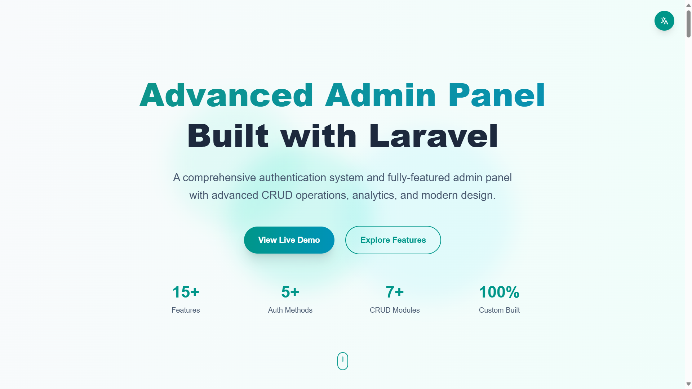

## ✨ Key Features

### 🔑 Authentication & Security
- **Smart Login System** - Login with username, email, or mobile number
- **Password Reset** - Secure password recovery system
- **OTP Verification** - SMS and email-based verification
- **OAuth Integration** - Google, GitHub (easily extensible)
- **Custom Error Pages** - Branded 401, 403, 404, 419, 429, 500, 503 pages  

  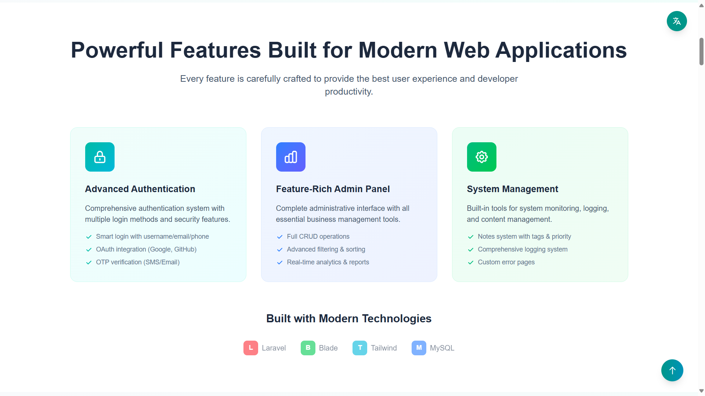
  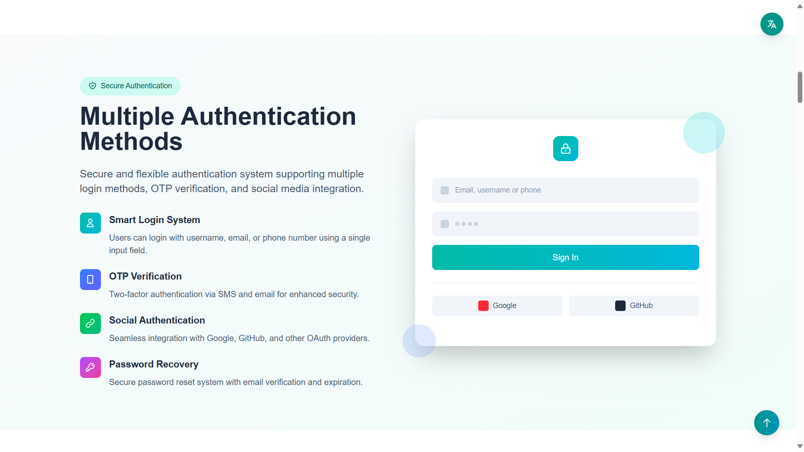

### 📊 Admin Dashboard
- **Comprehensive Stats Dashboard** - Monthly revenue, orders, analytics with interactive charts
- **Advanced Filtering & Sorting** - Powerful data management across all modules
- **Real-time Data** - Live updates and statistics  

  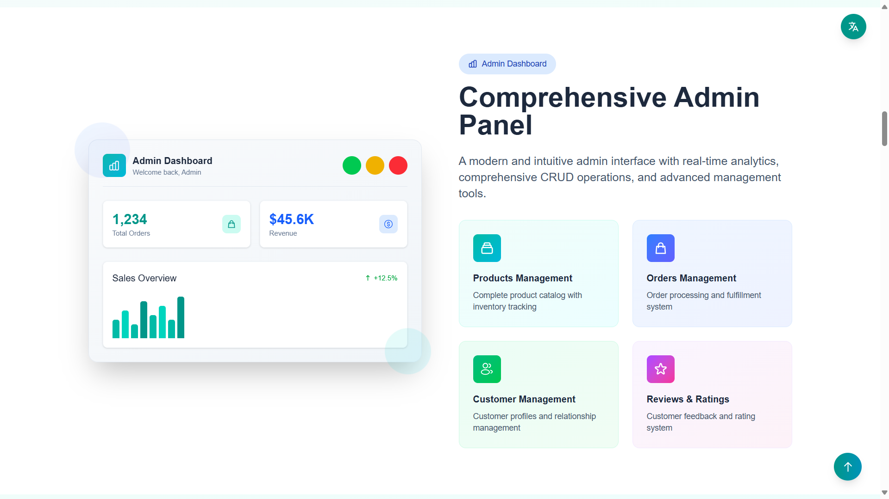
  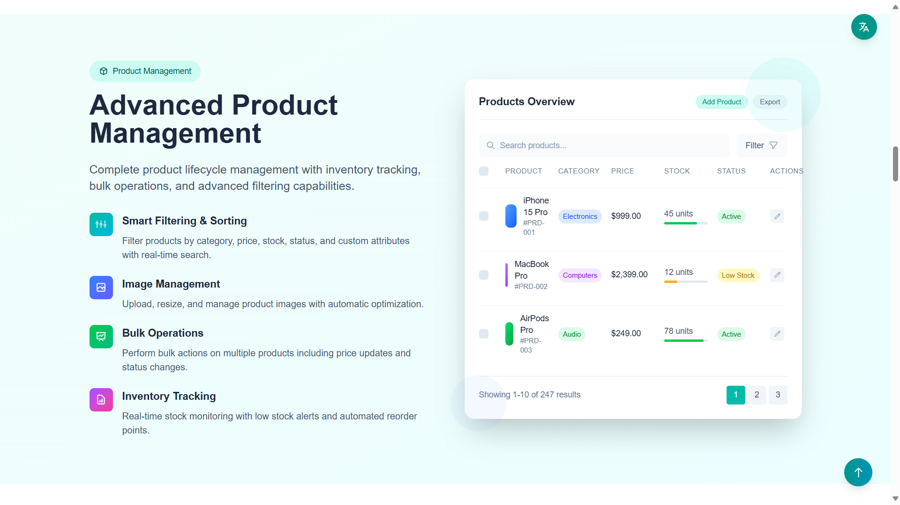

### 🛍️ E-commerce Management
- **Products CRUD** - Complete product management with custom filtering, sorting, and bulk operations
- **Orders Management** - Full order lifecycle with statistics, filtering, and status tracking
- **Customer Management** - Dedicated customer profiles with order history and detailed information
- **Review & Rating System** - Approve, reject, reply to reviews with advanced filtering  

  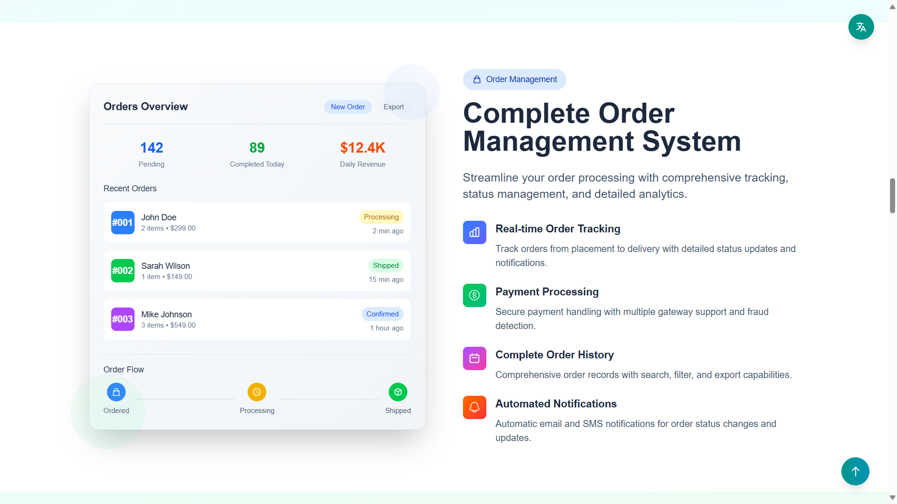
  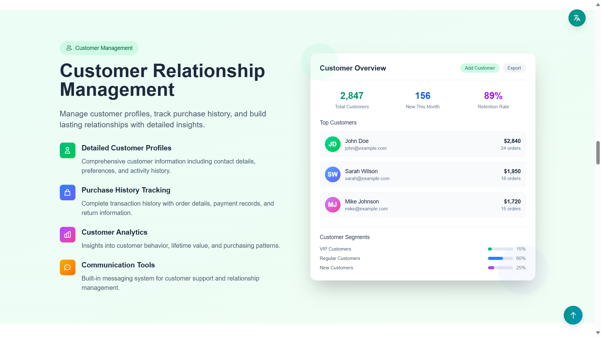

### 📝 Content Management
- **Note System** - Organized notes with status, priority, pinning, and tagging
- **Activity Logs** - Comprehensive logging system with sorting and filtering
- **Custom Pages** - Terms of service and privacy policy pages  

  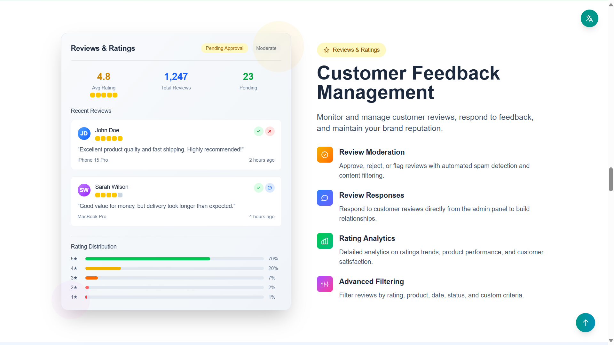
  

### 🎨 User Experience
- **Responsive Design** - Mobile-first approach with TailwindCSS
- **Custom UI Components** - Professionally designed interface
- **Intuitive Navigation** - User-friendly admin experience  

  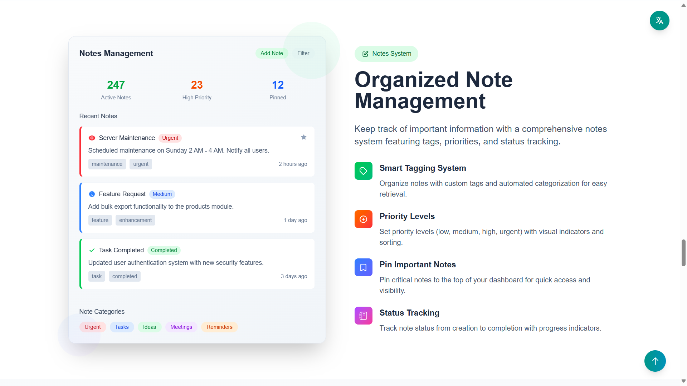
  

### 🔮 Upcoming Features
- SEO optimization tools
- User preferences management
- Theme switching (Light/Dark mode)
- Multi-language support
- Advanced reporting  

  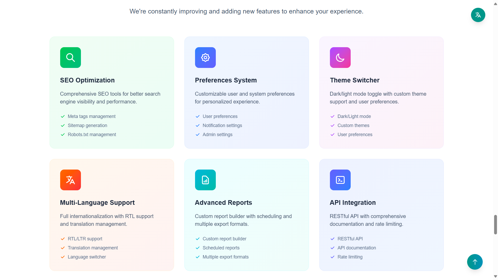
  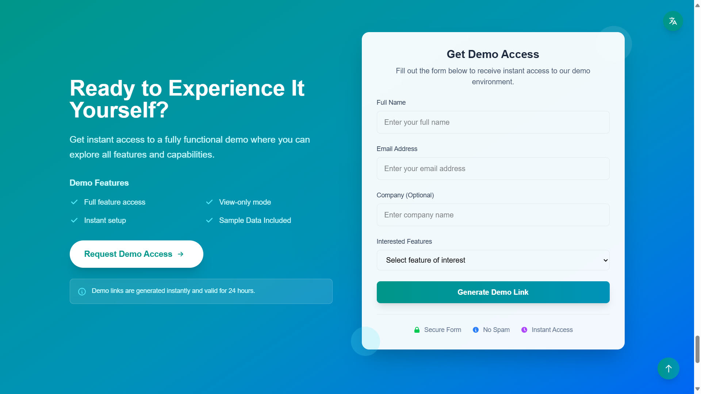

## 🛠️ Technology Stack
- **Backend**: Laravel (PHP)
- **Frontend**: Blade Templates, TailwindCSS
- **Database**: MySQL/PostgreSQL
- **Authentication**: Laravel Sanctum/Passport
- **Notifications**: SMS/Email services
- **Charts**: Chart.js/ApexCharts
- **Icons**: Heroicons/Feather Icons

## 📸 Screenshots

### Dashboard Overview
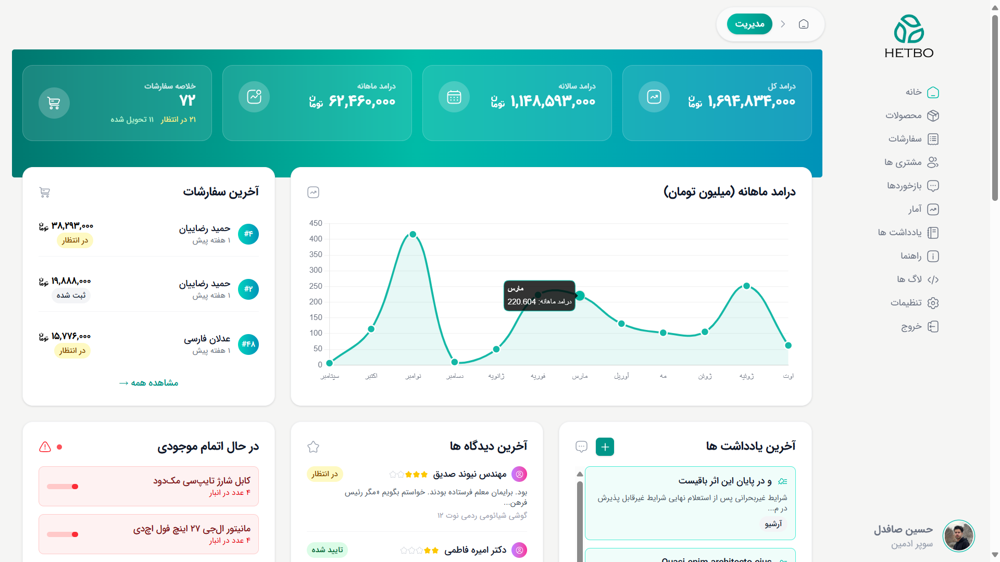
*Main dashboard with statistics and quick insights*

### Smart Login System

*Multi-method login interface*

### Products Management

*Advanced product management with filtering*

### Orders Management
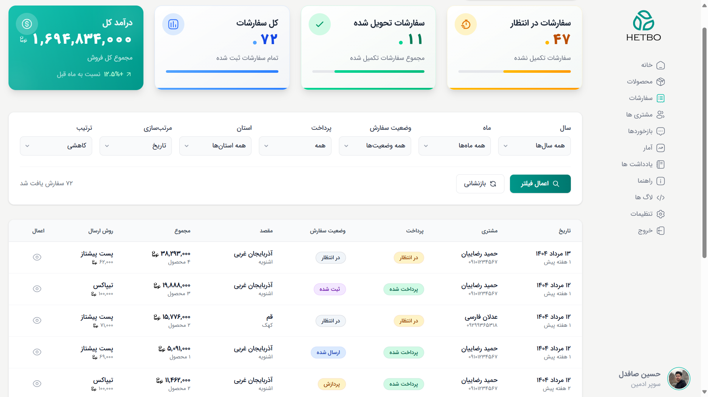
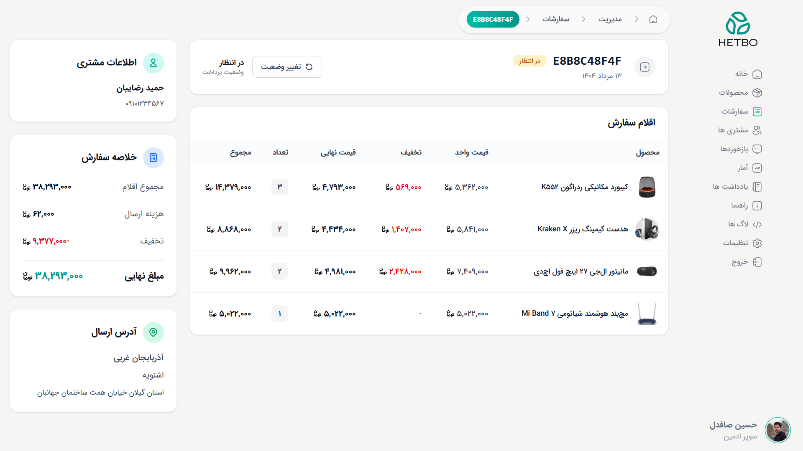
*Comprehensive order management system*

### Customer Profiles

*Detailed customer management*

### Analytics & Reports
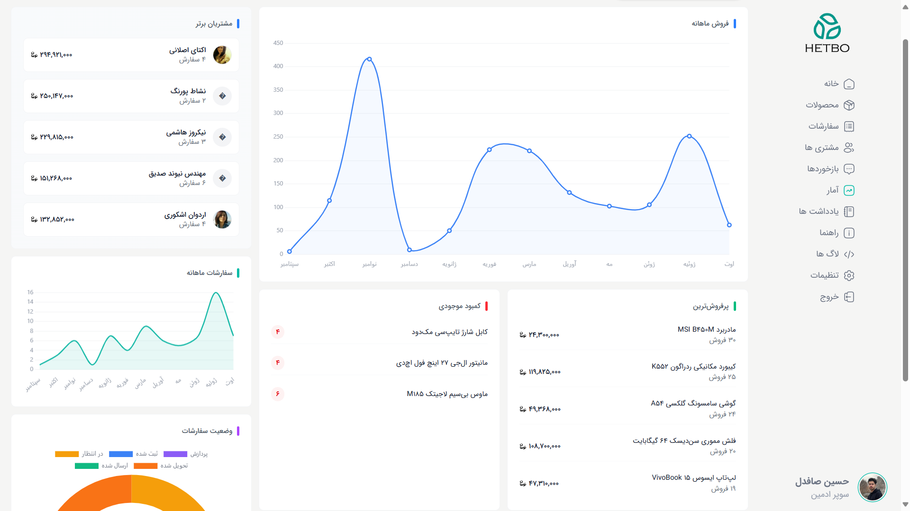
*Interactive charts and reporting*

### Notes System

*Organized note management with priorities*

## 🎯 Usage
### Learn More
- **URL**: `https://panel.hetbo.net`
- **Contact me**: `hetbo98@yahoo.com`

### Demo Generation
Users can request demo access through the landing page. A unique demo link will be generated allowing them to explore all features in read-only mode.

## 🤝 Contributing
This is a portfolio project, but feedback and suggestions are welcome!

## 👨‍💻 About the Developer
This project was developed as part of my portfolio to demonstrate proficiency in:
- Laravel framework and PHP best practices
- Modern frontend development with TailwindCSS
- Database design and optimization
- Authentication and security implementation
- Admin panel UX/UI design
- API integrations (OAuth, SMS, Email)

## 📞 Contact & Support
- **Portfolio**: [https://hetbo.net](https://hetbo.net)
- **Telegram**: [https://t.me/safdelhosein](https://t.me/safdelhosein)
- **Email**: [hetbo98@yahoo.com](mailto:hetbo98@yahoo.com)
- **Demo Request**: [panel.hetbo.net#demo](https://panel.hetbo.net/#demo)

---

⭐ **Star this repository if you find it helpful!**

*Built with ❤️ using Laravel, Blade, and TailwindCSS*
